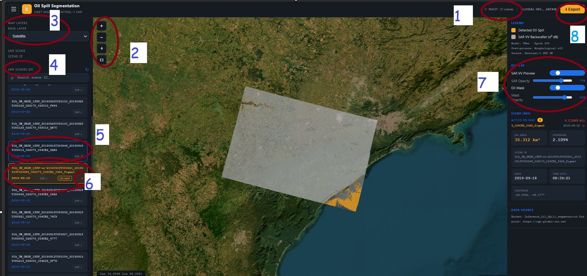

# Oil Spill Segmentation Viewer — User Guide

*How to view detected oil spills from Sentinel-1 SAR imagery*

## Opening the Viewer

The viewer runs as a web application accessed through your JupyterHub account. Open the following URL in your browser, replacing the username with your own:

```
https://jhub.glodal-inc.net/user/sachin11-geomatics/proxy/8050/
```

Once the page loads, the viewer will display the map interface shown below.



*Figure 1 — Viewer interface with numbered reference points used throughout this guide*

---

## Using the Viewer — Step by Step

The numbers below correspond to the numbered callouts in Figure 1.

**1. Wait for the status indicator**
At the top of the screen, wait until the status reads "READY" along with the number of scenes loaded (for example, "READY · 21 scenes"). This confirms the viewer has finished loading all available SAR data.

**2. Use the map navigation controls**
On the left side of the map, use the **+** and **−** buttons to zoom in and out, the compass/pan icon to reset orientation, and the square icon to fit the view to the current scene extent.

**3. Choose a basemap**
In the Map Layers panel (top left), use the Base Layer dropdown to switch between basemap styles such as Satellite, OpenStreetMap, or other available options, depending on your preference.

**4. Browse available SAR scenes**
The SAR Scenes panel on the left lists every scene available in the current dataset, along with the total count (e.g. "SAR SCENES (21)"). Use the search box to filter scenes by ID if you are looking for a specific one.

**5. Select a scene to load it on the map**
Click any scene in the list to load its footprint and imagery onto the map. The selected scene will highlight in the list.

**6. Manage layers on the map**
Once a scene is active, it appears with an "ON MAP" badge in the scene list. To remove a layer from the map view, use the cross (×) button next to its entry, or use "CLEAR ALL" in the Scene Info panel on the right to remove every active layer at once.

**7. Adjust transparency and visualization**
On the right side, use the Display controls to toggle the SAR VV Preview and Oil Mask layers on or off, and use the SAR Opacity and Mask Opacity sliders to control how transparent each layer appears over the basemap.

**8. Export the current map view**
Click the Export button in the top right corner to download a PNG screenshot of the current map view, including all visible layers.

---

## Reading the Scene Information Panel

When a scene is active, the right-hand panel displays key details about it:

| Field | Description |
|-------|-------------|
| Oil Area | Total estimated area of detected oil spill, in square kilometers. |
| Coverage | Percentage of the scene footprint covered by the detected spill. |
| Scene ID | Full Sentinel-1 product identifier for the active scene. |
| Date / Time (UTC) | Acquisition date and time of the SAR scene. |
| Centroid | Latitude/longitude coordinates of the detected spill's center point. |
| Data Source | The S3 bucket and endpoint the data was retrieved from. |

---

## Understanding the Legend

The Legend panel (top right) explains the colors used on the map:

- **Orange:** areas the model has classified as a detected oil spill.
- **Grey:** raw SAR VV backscatter (0° dB), shown as a grayscale radar image.

Below the legend, the panel also lists technical details about the active model run, including the model name, training epoch, post-processing method, and source satellite data.

---

## Tips

- Only one scene can be the primary focus at a time, but multiple layers can remain visible together — use the opacity sliders to compare them.
- If the map appears blank after selecting a scene, wait a moment for tiles to load, then try zooming in or out slightly.
- Use "CLEAR ALL" before loading a new scene if the map becomes cluttered with previous layers.

> **Need help?** If the viewer does not load, shows "0 scenes," or the page fails to open at your proxy URL, contact your system administrator — the underlying data pipeline may not have finished processing yet.

---

*GLODAL INC., Japan*
